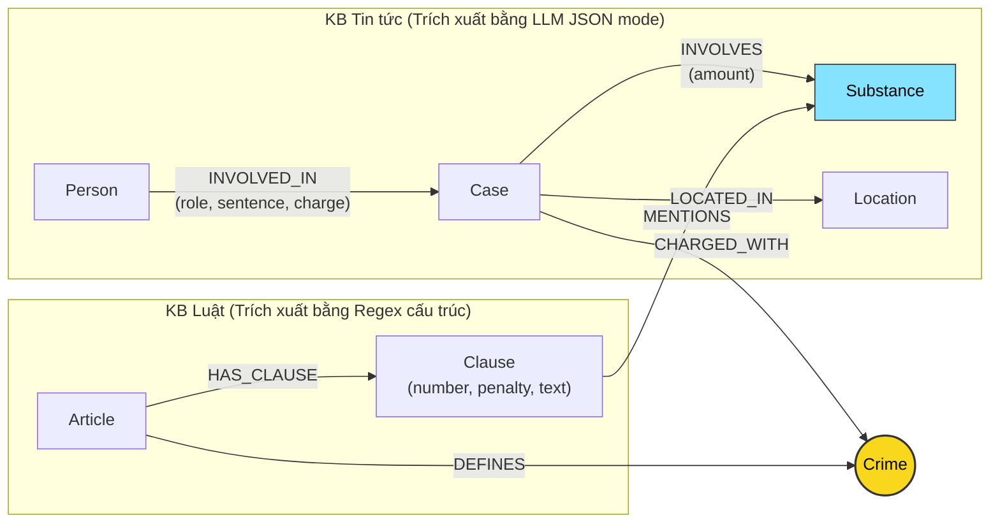

# Thiết kế Ontology — Day 19

**Họ tên:** Nguyễn Viết Dũng  **MSSV:** 2A202602533

**Lựa chọn** (đánh dấu một):
- [x] Dùng ontology gợi ý (có thể chỉnh nhỏ)
- [ ] Tự thiết kế (xét bonus +15, xem `SUBMISSION.md`)

> Hướng dẫn: `LAB_GUIDE.md` Bước 2. Dùng ontology gợi ý thì vẫn phải điền đủ các mục dưới đây bằng lời của bạn.

## 1. Sơ đồ

Sơ đồ mô hình hóa Knowledge Graph kết nối 2 cơ sở tri thức: Luật ma túy (`blhs-*`) và Tin tức xét xử (`news-*`):

* **Node cầu nối chính:** `Crime` (màu vàng) là điểm hội tụ giữa điều luật định nghĩa tội danh (`Article -[:DEFINES]-> Crime`) và các vụ án bị truy tố xét xử (`Case -[:CHARGED_WITH]-> Crime`).
* **Node cầu nối phụ:** `Substance` (màu xanh) kết nối các chất xuất hiện trong tang vật vụ án (`Case -[:INVOLVES]-> Substance`) và các chất được quy định trong khung hình phạt của từng khoản luật (`Clause -[:MENTIONS]-> Substance`).

---

## 2. Entity types (node labels)

| Label | Ý nghĩa | Khóa định danh (`MERGE` theo) | Properties | Lấy từ KB nào | Trích bằng (regex / LLM / khác) |
| --- | --- | --- | --- | --- | --- |
| `Article` | Điều luật trong BLHS hoặc Luật PCMT | `id` (vd: `"Điều 251 BLHS"`) | `id`, `title`, `law`, `doc_id` | Luật | Regex tiêu đề điều luật |
| `Clause` | Khoản quy định mức phạt và hành vi cụ thể | `id` (vd: `"Điều 251 BLHS khoản 1"`) | `id`, `number`, `penalty`, `text`, `doc_id` | Luật | Regex tách số khoản và câu phạt tù |
| `Crime` | Tên tội danh pháp lý chuẩn hóa | `name` (vd: `"mua bán trái phép chất ma túy"`) | `name` | Luật (chính), Tin tức | Tiêu đề Điều luật (Regex) + LLM entity linking |
| `Substance` | Tên chất ma túy hoặc tiền chất | `name` (vd: `"Heroine"`, `"MDMA"`, `"Ketamine"`) | `name` | Cả hai KB | Danh mục từ khóa chuẩn + Regex trong luật / LLM trong tin |
| `Case` | Vụ án / vụ việc xét xử | `name` (tên vắn tắt vụ án) | `name`, `summary`, `date`, `doc_id` | Tin tức | LLM (Prompt có structured JSON) |
| `Person` | Bị cáo, đối tượng liên quan | `name` (họ tên đầy đủ) | `name`, `aliases` | Tin tức | LLM (Prompt có structured JSON) |
| `Location` | Địa điểm diễn ra vụ việc, phiên tòa | `name` (tên địa phương) | `name` | Tin tức | LLM (Prompt có structured JSON) |

---

## 3. Relationships

| Type | Từ → Đến | Properties trên cạnh | Ý nghĩa |
| --- | --- | --- | --- |
| `DEFINES` | `Article` → `Crime` | Không | Điều luật định nghĩa tội danh tương ứng |
| `HAS_CLAUSE` | `Article` → `Clause` | Không | Điều luật bao gồm các khoản quy định chi tiết khung hình phạt |
| `MENTIONS` | `Clause` → `Substance` | Không | Khoản luật quy định hình phạt áp dụng cho chất ma túy cụ thể |
| `CHARGED_WITH` | `Case` → `Crime` | Không | Vụ án xét xử về tội danh pháp lý xác định |
| `INVOLVES` | `Case` → `Substance` | `amount` (khối lượng thu giữ) | Tang vật ma túy bị phát hiện hoặc buôn bán trong vụ án |
| `LOCATED_IN` | `Case` → `Location` | Không | Vụ án xảy ra hoặc được thụ lý xét xử tại địa bàn |
| `INVOLVED_IN` | `Person` → `Case` | `role` (vai trò), `sentence` (mức án sơ thẩm), `charge` (tội danh quy kết) | Đối tượng tham gia vào vụ án với vai trò và mức án cụ thể |

---

## 4. Node cầu nối giữa 2 KB

* **Node nào:** `Crime` (Tội danh) là node cầu nối chính; `Substance` (Chất ma túy) là node cầu nối bổ trợ xác định khung định lượng.
* **Vì sao chọn node này:**
  * Báo chí luôn nhắc đến việc các đối tượng bị khởi tố, truy tố hoặc xét xử về một tội danh cụ thể (ví dụ: *"tội mua bán trái phép chất ma túy"*, *"tội vận chuyển trái phép chất ma túy"*).
  * Bộ luật Hình sự phân định cấu trúc theo từng tội danh tương ứng với từng Điều luật cụ thể.
  * Vì vậy, nối vụ án qua tội danh sẽ trỏ trực tiếp đến đúng Điều luật gốc trong BLHS.
* **Cách đảm bảo hai phía khớp tên:**
  1. Sử dụng hàm `normalize_crime` đưa về chữ thường, bỏ dấu ngoặc kép, khoảng trắng thừa và tiền tố `"tội "`.
  2. Cung cấp danh sách tên tội danh chuẩn từ KB Luật vào prompt trích xuất cho LLM.
  3. Sử dụng hàm `link_entity` kết hợp so khớp chính xác (exact match) và thuật toán xấp xỉ `difflib.get_close_matches(cutoff=0.8)` để map các biến thể từ ngữ tự do của nhà báo về đúng tên tội danh chuẩn trong luật.
* **Khi nào cầu gãy, và bạn xử lý thế nào:**
  * **Cầu gãy khi:**
    - Báo chí viết tắt, dùng thuật ngữ dân dã hoặc hành vi chung chung (vd: *"buôn ma túy"*, *"ôm hàng"* thay vì *"mua bán trái phép chất ma túy"*), dẫn đến độ tương đồng < 0.8.
    - Bài báo chỉ nêu giai đoạn điều tra ban đầu khi chưa khởi tố tội danh cụ thể, hoặc tội danh chưa có trong tập dữ liệu luật đã nạp.
  * **Xử lý:**
    - Không gán bừa (trả về `None`) để tránh nối sai làm sai lệch thông tin pháp lý.
    - Sử dụng node cầu nối phụ là `Substance` (chất ma túy) kết hợp vector search top-k chunk để bổ trợ context khi quan hệ `CHARGED_WITH` không thể thiết lập.

---

## 5. Competency questions

| Câu | Đường đi (Cypher pattern) | Trả lời được? |
| --- | --- | --- |
| Q1 (Khái niệm tiền chất) | `MATCH (a:Article)-[:HAS_CLAUSE]->(cl:Clause) WHERE a.id CONTAINS 'phòng, chống ma túy' OR a.title CONTAINS 'tiền chất' RETURN cl.text` | Trả lời tốt (single-hop trên KB Luật) |
| Q2 (Bị cáo án tử hình vụ 36kg) | `MATCH (p:Person)-[r:INVOLVED_IN]->(k:Case) WHERE r.sentence CONTAINS 'tử hình' AND (k.summary CONTAINS '36kg' OR k.name CONTAINS '36kg') RETURN p.name, r.sentence` | Trả lời tốt (single-hop trên KB Tin tức) |
| Q3 (Lê Minh Thành mức án, tội gì, Điều nào, khung cơ bản) | `MATCH (p:Person {name: 'Lê Minh Thành'})-[r:INVOLVED_IN]->(k:Case)-[:CHARGED_WITH]->(c:Crime)<-[:DEFINES]-(a:Article)-[:HAS_CLAUSE]->(cl:Clause {number: 1}) RETURN p.name, r.sentence, c.name, a.id, cl.penalty` | Trả lời tốt (multi-hop xuyên 2 KB qua cầu nối `Crime`) |
| Q4 (Dương Minh Tuấn / Hoàng Nato hành vi, phạt tối đa) | `MATCH (p:Person)-[r:INVOLVED_IN]->(k:Case)-[:CHARGED_WITH]->(c:Crime)<-[:DEFINES]-(a:Article)-[:HAS_CLAUSE]->(cl:Clause) WHERE p.name = 'Dương Minh Tuấn' OR 'Hoàng Nato' IN p.aliases RETURN c.name, a.id, cl.number, cl.penalty` | Trả lời tốt (tìm qua alias `Hoàng Nato` -> `Case` -> `Crime` -> `Article` -> lấy các khung hình phạt) |
| Q5 (Cái Quang Huy tội danh, chất, khối lượng -> áp dụng khoản nào và khung phạt) | `MATCH (p:Person {name: 'Cái Quang Huy'})-[r:INVOLVED_IN]->(k:Case)-[:CHARGED_WITH]->(c:Crime)<-[:DEFINES]-(a:Article)-[:HAS_CLAUSE]->(cl:Clause)-[:MENTIONS]->(s:Substance) WHERE (k)-[:INVOLVES]->(s) RETURN c.name, s.name, a.id, cl.number, cl.penalty` | Trả lời tốt (multi-hop qua cả `Crime` và `Substance` để đối chiếu khối lượng 9.6kg MDMA với khoản 4) |
| Q6 (Các vụ việc liên quan đến MDMA) | `MATCH (k:Case)-[:INVOLVES]->(s:Substance) WHERE toLower(s.name) = 'mdma' OPTIONAL MATCH (p:Person)-[:INVOLVED_IN]->(k) RETURN k.name, k.summary, collect(p.name)` | Trả lời tốt (aggregation gom các vụ án có liên kết cạnh `INVOLVES` tới node MDMA) |

---

## 6. Quyết định thiết kế và đánh đổi

1. **Tách node `Clause` độc lập với `Article` thay vì gộp toàn bộ nội dung Điều luật vào property của `Article`:**
   * *Đã chọn:* Tạo riêng node `Clause` mang các property `number`, `penalty`, `text`.
   * *Phương án khác:* Chỉ tạo node `Article` và lưu toàn bộ văn bản điều luật trong property `text`.
   * *Lý do chọn:* Mức phạt trong luật hình sự phân cấp theo từng khoản tùy theo khối lượng và tính chất phạm tội. Tách node `Clause` cho phép Cypher lọc chính xác khoản 1 (khung cơ bản) hoặc khoản có nhắc đến chất tang vật mà không làm prompt bị bùng nổ token khi nạp toàn bộ một Điều luật dài vào LLM.

2. **Dùng thuộc tính trên cạnh `INVOLVED_IN (sentence, role, charge)` thay vì tạo node `Sentence` / `Role` riêng:**
   * *Đã chọn:* Đặt `sentence` (hình phạt), `role` (vai trò), `charge` (tội danh) làm property của relationship giữa `Person` và `Case`.
   * *Phương án khác:* Tạo node `Verdict` hoặc `Sentence` riêng nối với `Person` và `Case`.
   * *Lý do chọn:* Mức án và vai trò là thông tin gắn liền với một cá nhân trong một phiên xử cụ thể. Biểu diễn dưới dạng property trên cạnh giúp graph gọn gàng, giảm số lượng hop không cần thiết khi duyệt đồ thị và truy vấn Cypher đơn giản hơn.

3. **Lựa chọn cơ chế trích xuất lai (Regex cho Luật, LLM cho Tin tức):**
   * *Đã chọn:* Dùng Regex biểu thức chính quy để phân tích cấu trúc cố định của Điều luật (`Điều...`, `1.`, `2.`, `a)`, `b)`), và dùng LLM với JSON mode để trích xuất văn xuôi tin tức báo chí.
   * *Phương án khác:* Dùng LLM cho cả 2 KB.
   * *Lý do chọn:* Văn bản quy phạm pháp luật có cấu trúc khuôn mẫu cực kỳ nghiêm ngặt, regex thực thi gần như tức thì (0 USD, 0 token, kết quả tất định 100%). Ngược lại, tin tức báo chí viết theo văn phong tự do nên LLM là công cụ tối ưu để trích xuất ngữ nghĩa.

---

## 7. So với ontology gợi ý (bắt buộc nếu xét bonus)

| Điểm khác | Gợi ý làm gì | Bạn làm gì | Vấn đề nó giải quyết | Bằng chứng (Cypher, hoặc số liệu benchmark) |
| --- | --- | --- | --- | --- |
| *Áp dụng theo ontology gợi ý chuẩn* | Mô hình hóa `Crime` làm cầu nối giữa `Article` và `Case`, `Substance` bổ trợ | Giữ nguyên cấu trúc gợi ý chuẩn để đảm bảo độ tin cậy và khớp hợp đồng benchmark | Giải quyết trọn vẹn câu hỏi multi-hop và truy xuất khung hình phạt theo chất | Xem kết quả kiểm thử tại `tests/test_graph.py` và `--check` |

---

## 8. Hạn chế còn lại

* **Khóa định danh của `Case` và `Person`:** Tên vụ án và đối tượng do LLM trích xuất tự do từ bài báo, dễ dẫn đến hiện tượng trùng thực thể (vd: bài báo ghi *"Lê Minh Thành"*, bài khác ghi *"Thành"* hoặc lỗi gõ dấu thì sẽ sinh 2 node `Person` khác nhau).
* **Định lượng khối lượng ma túy:** Graph liên kết `Case` với `Substance` có property `amount`, nhưng chưa mô hình hóa toán học các ngưỡng khối lượng (`>= 100g`, `30g - 100g`) của các điểm/khoản trong luật thành các quan hệ so sánh số học, nên việc suy luận khoản nào áp dụng vẫn phải dựa vào LLM đọc text của Clause.
* **Thời gian và trạng thái tố tụng:** Chưa tách biệt rõ rệt các giai đoạn tố tụng (bắt giữ ban đầu, khởi tố, xét xử sơ thẩm, phiên tòa phúc thẩm).
